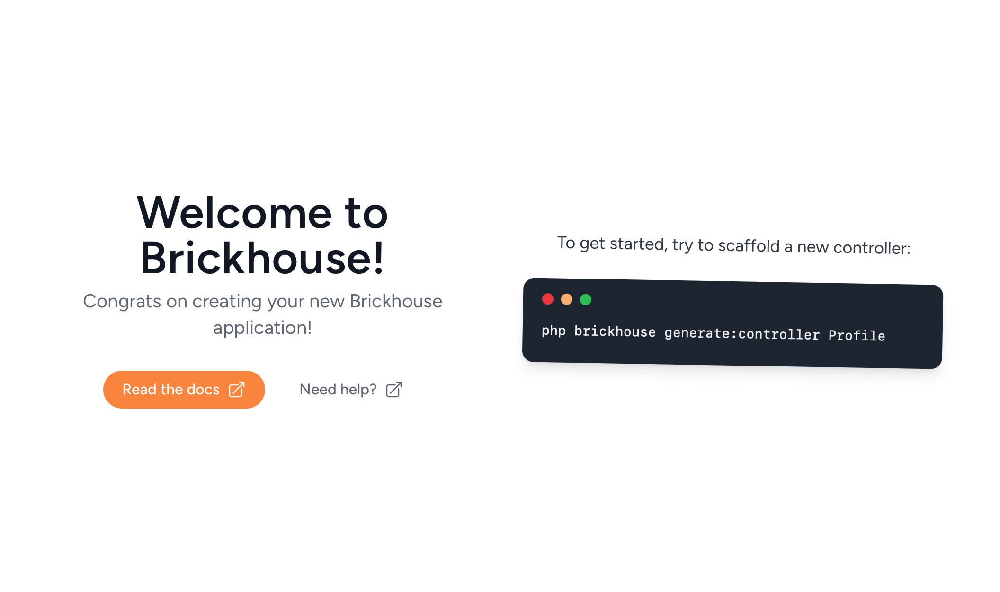

## Prerequisites

When installing and using Brickhouse, you'll need:
 - [PHP 8.4](https://www.php.net) or newer,
 - [Composer](https://getcomposer.org),
 - and a code editor.

To see your installed version of PHP, open a terminal and run the following command. You should see version number on the first line:

```bash
$ php --version
PHP 8.4.1 (cli) (built: Nov 20 2024 09:48:35) (NTS)
```

## Creating an application

When you have installed PHP and Composer, you can install the Brickhouse installer. This makes creating a new application much simpler:

```bash
composer global require brickhouse/installer
```

After you have installed PHP, Composer and the Brickhouse Installer, you can create a new Brickhouse application. For this, you can use Composer to create a new application:

```bash
brickhouse new example-app
```

After your new application has been created, you can go into it's directory:

```bash
cd example-app/
```

## Serving the application

Before going too deep, let's start the application. In your terminal, run the following command:

```bash
php brickhouse serve
```

This will start the development server which will serve our application. To view your application, open [http://localhost:8000](http://localhost:8000) in your browser. You should see something similar to this:



To stop the server again, press `Ctrl-C` in your terminal.